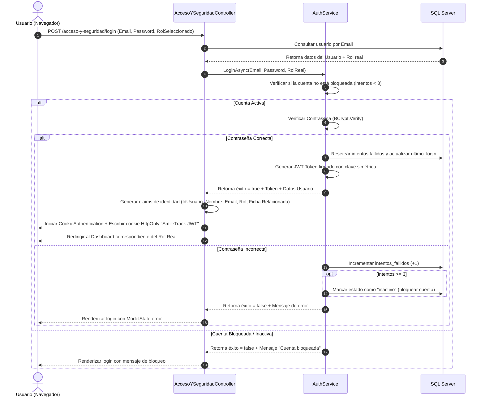
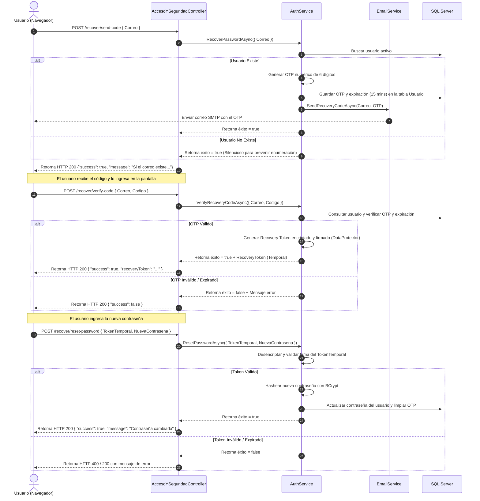
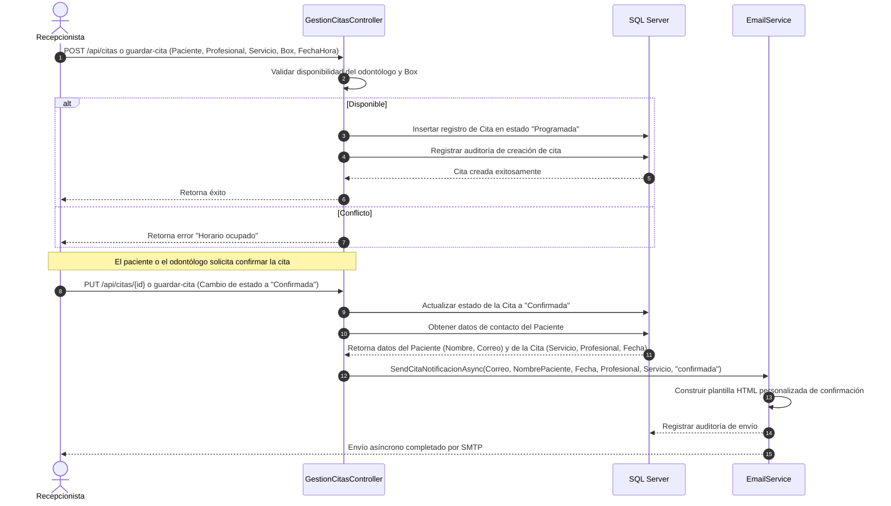
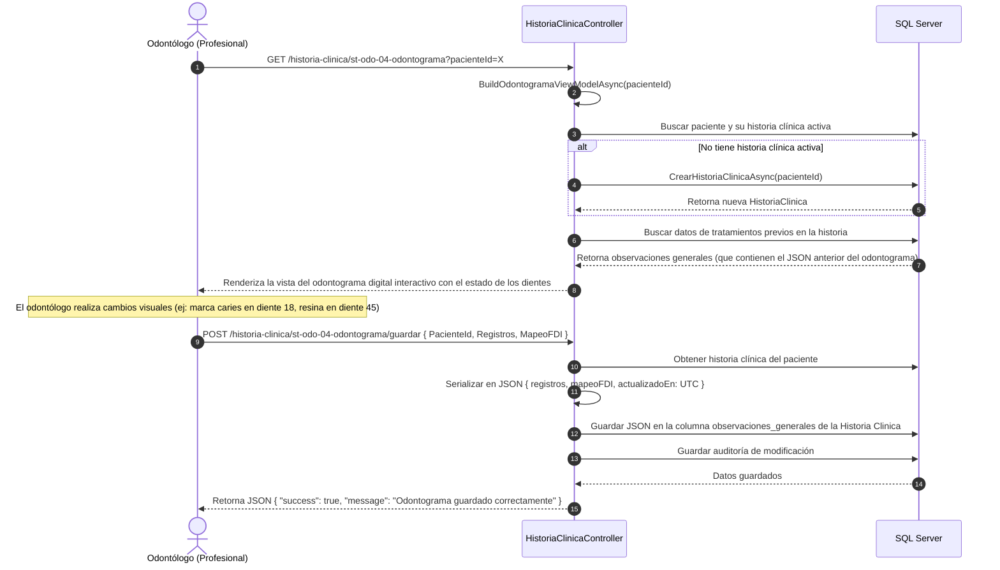

# Análisis Técnico Exhaustivo del Proyecto SmileTrack (Gestión de Clínica Odontológica)

SmileTrack es una aplicación web empresarial diseñada en la plataforma **.NET 9** utilizando el patrón arquitectónico **ASP.NET Core MVC**. El sistema está enfocado en la administración completa de una clínica odontológica, integrando la gestión de citas médicas, historiales clínicos digitales (con odontograma interactivo), facturación, PQRs (Preguntas, Quejas, Reclamos), inventarios, control de equipos médicos y auditoría interna.

---

## 1. Estructura de Directorios del Proyecto

El código fuente está organizado siguiendo las convenciones de ASP.NET Core MVC, distribuyendo las responsabilidades de la siguiente manera:

*   **`Controllers/`**: Contiene los controladores que exponen los endpoints y manejan las peticiones HTTP. Utilizan enrutamiento por atributos y coordinan la interacción entre los servicios de negocio, el contexto de base de datos y las vistas.
*   **`Models/`**: Capa de datos y transferencia. Se subdivide en:
    *   `Entities/`: Clases de entidades del dominio mapeadas a tablas de SQL Server mediante Entity Framework Core (EF Core).
    *   `ViewModels/`: Objetos de transferencia de datos (DTOs) diseñados específicamente para interactuar de forma segura con el frontend, evitando la exposición directa de las entidades de base de datos.
    *   `Shared/`: Clases o modelos compartidos por múltiples secciones.
*   **`Views/`**: Carpetas que albergan las vistas Razor (`.cshtml`). Cada controlador principal tiene su carpeta homóloga de vistas, donde se definen las interfaces de usuario.
*   **`Services/`**: Capa de lógica de negocio desacoplada de los controladores. Contiene la lógica de autenticación (`AuthService.cs`) y la mensajería (`Email/EmailService.cs`).
*   **`Data/`**: Aloja el contexto de base de datos de EF Core (`AppDbContext.cs`).
*   **`Database/`**: Contiene scripts de base de datos para la inicialización y migración (`SCRIPT_SQL_UNICO_SMILETRACK.sql`).
*   **`Helpers/`**: Clases auxiliares utilitarias como `EstadoCitaHelper.cs`.
*   **`wwwroot/`**: Archivos estáticos servidos directamente al navegador (CSS, JavaScript, imágenes y librerías externas de frontend como Bootstrap, FullCalendar, etc.).
*   **`SmileTrack_MVC.Tests/`**: Suite de pruebas unitarias y de integración para validar la lógica del backend.
*   **Archivos de Configuración en la Raíz:**
    *   `Program.cs`: Punto de entrada del sistema. Configura el contenedor IoC, las opciones de configuración, la base de datos, la seguridad (autenticación dual Cookie+JWT), rate limiters y el pipeline de middlewares HTTP.
    *   `appsettings.json` y `appsettings.Local.json`: Archivos JSON con variables de configuración del sistema (cadenas de conexión, llaves JWT, credenciales SMTP).

---

## 2. Funcionamiento de los Códigos Implementados

### A. Inicialización y Middleware (`Program.cs`)
El sistema cuenta con un pipeline HTTP y un contenedor de servicios altamente configurado:
1.  **Carga de Configuración Jerárquica:** Se limpia el proveedor de configuración y se carga en orden: `appsettings.json` $\rightarrow$ `appsettings.{Environment}.json` $\rightarrow$ `appsettings.Local.json` $\rightarrow$ User Secrets (si es *Development*) $\rightarrow$ Variables de Entorno y CLI. Esto evita que contraseñas locales sobrescriban secretos de producción.
2.  **Rate Limiting Nativo:** Configura dos políticas de ventana fija de 15 minutos en el inicio de sesión:
    *   `LoginByIp`: Permite un máximo de 10 intentos por dirección IP.
    *   `LoginByEmail`: Permite un máximo de 5 intentos por dirección de correo electrónico (protege contra ataques de diccionario dirigidos a cuentas específicas detrás de proxies corporativos).
    *   Retorna HTTP `429 Too Many Requests` con un JSON informativo para APIs o una redirección HTML amigable para navegadores.
3.  **Seguridad Antiforgery (CSRF):** Registra el middleware CSRF y expone cookies `XSRF-TOKEN` legibles por el frontend para validar peticiones POST AJAX de forma segura.
4.  **Autenticación Dual Coexistente:**
    *   *Autenticación basada en Cookies:* Esquema por defecto para el navegador web. Configura redirecciones a `/acceso-y-seguridad/login`, expiración deslizante de 8 horas, y un evento de validación `OnValidatePrincipal` que consulta en la base de datos en tiempo real si el usuario sigue activo o si realizó logout posterior (revocación inmediata de sesión).
    *   *Autenticación basada en JWT Bearer:* Para APIs y clientes externos. Lee el token del encabezado `Authorization` o de la cookie `SmileTrack-JWT`. Valida el emisor, la audiencia, la firma criptográfica y verifica contra la base de datos que el usuario no haya revocado el token al cerrar sesión.
5.  **Inicialización de Base de Datos Asíncrona (Seed en Background):** Para acelerar el arranque del servidor, el método `EnsureDatabaseSchemaAsync` se ejecuta en un hilo de fondo (`_ = Task.Run(...)`).
    *   Verifica si el script SQL `Database/SCRIPT_SQL_UNICO_SMILETRACK.sql` está bajo control de versiones de Git para seguridad antes de ejecutarlo.
    *   Aplica alteraciones de esquema y crea tablas complementarias (`Auditoria`, `Factura`, `PQR`, `Inventario`, `Equipo`, `Configuracion_General`).
    *   Realiza un "seed" inicial creando los roles, usuarios por defecto (`admin@smiletrack.co`, `prof@smiletrack.co`, etc.), especialidades clínicas, servicios médicos predeterminados, pacientes y consultorios.
6.  **Redirección Proxy `.cshtml`:** Si se solicita un archivo de vista directamente por URL (ej. `/Views/modulo/index.cshtml`), un middleware intercepta el request y lo redirige a través de `ViewProxyController` para procesar el archivo Razor con el motor de renderizado de ASP.NET, en lugar de servir el código fuente crudo.

### B. Base de Datos y Modelo de Datos (`AppDbContext.cs` y `Entities/`)
El archivo `AppDbContext.cs` define el mapeo relacional a SQL Server a través de EF Core.
*   Se especifican explícitamente los nombres de las tablas y las columnas en formato *snake_case* (`id_usuario`, `fecha_nacimiento`, etc.) para mantener consistencia con esquemas legacy o SQL directo.
*   **Entidades y Relaciones Clave:**
    *   `Usuario` $\rightarrow$ `Rol` (Muchos a Uno): Asigna permisos.
    *   `Paciente` $\rightarrow$ `Usuario` (Uno a Uno / Opcional): Vincula las credenciales de acceso con la ficha de datos clínicos del paciente.
    *   `Profesional` $\rightarrow$ `Usuario` (Uno a Uno / Opcional): Vincula credenciales con la ficha del odontólogo.
    *   `Profesional_Especialidad` (Tabla intermedia con clave compuesta): Mapea la relación Muchos a Muchos entre `Profesional` y `Especialidad`, identificando cuál es la especialidad principal (`principal = true`).
    *   `Cita`: Relaciona `Paciente`, `Profesional`, `Servicio` (limpieza, ortodoncia, etc.), `Consultorio` y `EstadoCita`.
    *   `HistoriaClinica` $\rightarrow$ `Paciente` (Uno a Uno): Ficha de control clínico que contiene las observaciones generales y el odontograma serializado.
    *   `PqrEntity`: Quejas o sugerencias enlazadas a un `Paciente` y asignadas a un `Usuario` (Administrador) para su atención.

### C. Servicio de Autenticación (`AuthService.cs`)
Centraliza las operaciones criptográficas y de seguridad:
*   **Inicio de Sesión (`LoginAsync`):**
    *   Busca al usuario y su rol.
    *   Si está inactivo, rechaza.
    *   Compara la contraseña en texto plano con el hash almacenado en base de datos usando **BCrypt**.
    *   Si es incorrecta, incrementa la columna `intentos_fallidos`. Al alcanzar 3 intentos fallidos, bloquea la cuenta cambiando su estado a "inactivo".
    *   Si es correcta, restablece los intentos fallidos, guarda la fecha en `ultimo_login` y genera un token JWT firmado.
*   **Recuperación de Contraseña (`RecoverPasswordAsync`, `VerifyRecoveryCodeAsync`, `ResetPasswordAsync`):**
    *   Genera un código OTP numérico aleatorio de 6 dígitos con vigencia de 15 minutos.
    *   Registra el código y su expiración en el usuario.
    *   Al validarse el OTP, el sistema genera un **token de recuperación temporal firmado y encriptado** utilizando la API de *Data Protection* de ASP.NET (`IDataProtector`). Esto previene la manipulación del token desde el cliente.
    *   El token temporal se intercambia en el endpoint de reestablecimiento para guardar la nueva contraseña (la cual debe cumplir con políticas de complejidad y es hasheada con BCrypt).
*   **Cambio de Contraseña (`ChangePasswordAsync`):** Permite a usuarios logueados cambiar su contraseña validando primero su credencial actual.

### D. Servicio de Correo (`EmailService.cs`)
Implementa `IEmailService` usando la librería estándar `System.Net.Mail`.
*   Lee la configuración SMTP del objeto `EmailServiceOptions` (enlazado a la sección `"Smtp"` en `appsettings.Local.json`).
*   **`SendRecoveryCodeAsync`**: Envía correos con plantillas HTML limpias para la recuperación de contraseñas.
*   **`SendCitaNotificacionAsync`**: Notifica al correo del paciente cuando una cita cambia de estado. Genera un correo dinámico según sea **Confirmada** o **Cancelada**.
*   **`ProbarConfiguracionSmtpAsync`**: Herramienta de diagnóstico que ejecuta un test de 4 pasos (verificar credenciales, conectar, autenticar con el host e intentar enviar un mensaje de prueba). Devuelve un log técnico detallado en caso de fallos.

---

## 3. Conexiones e Integraciones

### Conexión a Base de Datos (Interna y Externa)
*   **Proveedor:** Entity Framework Core con Microsoft SQL Server (`Microsoft.EntityFrameworkCore.SqlServer`).
*   **Estrategia de Resiliencia:** Configurado con `EnableRetryOnFailure` en `Program.cs` para reintentar automáticamente la conexión ante fallos transitorios de red (3 reintentos con desfases de hasta 3 segundos).
*   **Cadenas de Conexión:**
    *   Si no se especifica en configuración, utiliza un fallback a LocalDB: `Server=(localdb)\mssqllocaldb;Database=SmileTrackDB;Trusted_Connection=True;`.
    *   En `appsettings.Local.json` se apunta a un contenedor local u otra instancia de SQL Server (`Server=localhost,1433;Database=SmileTrackDB;User Id=sa;Password=SmileTrack#2025;`).

### Conexiones de Autenticación
*   **Cookies:** Almacenamiento seguro en el navegador. Las cookies de sesión están marcadas como `HttpOnly` y `SameSite=Lax`.
*   **JWT Bearer:** Encriptación asimétrica mediante clave simétrica (`SymmetricSecurityKey`) definida en configuración. Sirve de puente con clientes móviles, APIs externas o llamadas fetch en el frontend para evitar cookies en arquitecturas desacopladas.

### Integración SMTP (Externa)
*   Se conecta al host SMTP externo (por defecto `smtp.gmail.com` en puerto `587` con TLS/SSL habilitado).
*   Requiere autenticación mediante correo y contraseña. Para entornos con Gmail, se utiliza una **Contraseña de Aplicación de 16 dígitos** debido al desuso de autenticación básica por Google (LSA).

---

## 4. Rutas y Endpoints de la Aplicación

El sistema utiliza enrutamiento basado en atributos en los controladores. A continuación se detallan las rutas públicas, de navegación y APIs:

### Módulo: Acceso y Seguridad (`AccesoYSeguridadController`)
| Método | Ruta | Rol Requerido | Descripción |
| :--- | :--- | :--- | :--- |
| **GET** | `/acceso-y-seguridad/login` | Público | Muestra la vista de inicio de sesión. |
| **POST** | `/acceso-y-seguridad/login` | Público | Procesa credenciales e inicia sesión (Cookie/JWT). |
| **POST** | `/acceso-y-seguridad/logout` | Autenticado | Cierra sesión y revoca tokens. |
| **GET** | `/acceso-y-seguridad/recover` | Público | Página para iniciar recuperación de contraseña. |
| **POST** | `/acceso-y-seguridad/recover/send-code` | Público | Envía el código OTP de 6 dígitos por email. |
| **POST** | `/acceso-y-seguridad/recover/verify-code` | Público | Verifica el código OTP y retorna un token temporal. |
| **POST** | `/acceso-y-seguridad/recover/reset-password`| Público | Restablece la contraseña usando el token temporal. |
| **GET** | `/acceso-y-seguridad/cambiar-contrasena`| Autenticado | Formulario para cambiar la contraseña actual. |
| **POST** | `/acceso-y-seguridad/cambiar-contrasena`| Autenticado | Procesa el cambio de contraseña de la sesión. |
| **GET** | `/acceso-y-seguridad/register` | Público | Formulario de auto-registro para Pacientes. |
| **POST** | `/acceso-y-seguridad/register` | Público | Crea la cuenta y la ficha de paciente. |
| **GET** | `/acceso-y-seguridad/st-adm-02-gestion-usuarios` | Administrador | Vista de administración de usuarios de la clínica. |
| **GET** | `/acceso-y-seguridad/st-adm-03-gestion-roles` | Administrador | Matriz y lista de roles de usuario. |
| **GET** | `/acceso-y-seguridad/st-adm-15-bitacora` | Administrador | Visualización de auditorías de base de datos. |
| **GET** | `/acceso-y-seguridad/st-adm-16-test-smtp` | Administrador | Diagnóstico visual para pruebas de correo SMTP. |
| **GET** | `/acceso-y-seguridad/st-adm-16-test-smtp/run`| Administrador | Ejecuta el test de diagnóstico SMTP (API JSON). |

### Módulo: Gestión de Citas (`GestionCitasController`)
| Método | Ruta | Rol Requerido | Descripción |
| :--- | :--- | :--- | :--- |
| **GET** | `/gestion-de-citas/st-adm-01-dashboard` | Administrador | Dashboard principal de administración de la clínica. |
| **GET** | `/gestion-de-citas/st-adm-08-agenda` | Administrador | Vista de agenda médica en calendario interactivo. |
| **GET** | `/gestion-de-citas/st-adm-09-citas` | Administrador | Tablas de control de todas las citas del sistema. |
| **GET** | `/gestion-de-citas/st-rec-01-dashboard` | Recepcionista | Dashboard resumido para recepción. |
| **GET** | `/gestion-de-citas/st-rec-03-gestion-citas` | Recepcionista | Agenda interactiva para programar y reprogramar. |
| **GET** | `/gestion-de-citas/st-rec-05-recordatorios` | Recepcionista | Recordatorios de citas del día. |
| **GET** | `/gestion-de-citas/st-odo-02-agenda` | Profesional | Agenda personal asignada al odontólogo logueado. |
| **GET** | `/gestion-de-citas/st-pac-01-mis-citas` | Paciente | Historial y programación de citas del paciente. |
| **GET** | `/gestion-de-citas/st-pac-03-notificaciones`| Paciente | Centro de notificaciones para el paciente. |
| **GET** | `/gestion-de-citas/st-aux-01-panel-operativo/panel-operativo` | Auxiliar | Panel del auxiliar clínico para ver citas en curso. |
| **GET** | `/gestion-de-citas/st-aux-02-agenda-apoyo` | Auxiliar | Agenda de apoyo clínico. |
| **GET** | `/gestion-de-citas/st-aux-05-historial-parcial`| Auxiliar | Historial clínico simplificado. |
| **GET** | `/gestion-de-citas/st-aux-06-asistencia-procedi`| Auxiliar | Registro de asistencia del auxiliar a cirugías. |
| **GET** | `/gestion-de-citas/st-aux-09-estado-consultorio`| Auxiliar | Control de limpieza y desinfección de Boxes. |
| **GET** | `/gestion-de-citas/st-aux-10-citas-finalizadas`| Auxiliar | Citas atendidas del día. |
| **POST**| `/gestion-de-citas/guardar-cita` | Recepcionista, Admin, Paciente | Guarda o actualiza una cita (Form tradicional). |
| **POST**| `/gestion-de-citas/eliminar-cita` | Recepcionista, Admin | Elimina o cancela una cita (Form tradicional). |
| **GET** | `/api/appointments` | Autenticado | Obtiene lista de citas filtradas por fecha o rol. |
| **GET** | `/api/citas/agenda` | Autenticado | Listado formateado para FullCalendar. |
| **POST**| `/api/citas` | Autenticado | Endpoint API para agendar citas. |
| **PUT** | `/api/citas/{id:int}` | Autenticado | Endpoint API para reprogramar o cambiar estado. |
| **DELETE**| `/api/citas/{id:int}` | Autenticado | Endpoint API para cancelar o borrar citas. |

### Módulo: Historia Clínica (`HistoriaClinicaController`)
| Método | Ruta | Rol Requerido | Descripción |
| :--- | :--- | :--- | :--- |
| **GET** | `/historia-clinica/st-odo-03-historial` | Profesional | Historial completo de un paciente específico. |
| **GET** | `/historia-clinica/st-odo-04-odontograma` | Profesional | Editor interactivo del Odontograma Digital. |
| **POST**| `/historia-clinica/st-odo-04-odontograma/guardar`| Profesional | Guarda el JSON del odontograma del paciente. |
| **GET** | `/historia-clinica/st-odo-06-pacientes` | Profesional | Buscador de pacientes para odontólogos. |
| **GET** | `/historia-clinica/st-odo-07-seguimiento-tratamiento`| Profesional | Ficha de evolución clínica. |
| **GET** | `/historia-clinica/st-pac-02-historial` | Paciente | Autoconsulta del historial clínico propio. |
| **GET** | `/historia-clinica/st-adm-historial` | Administrador | Consulta administrativa de expedientes. |
| **GET** | `/historia-clinica/st-rec-historial` | Recepcionista | Consulta de expedientes clínicos. |
| **GET** | `/historia-clinica/st-aux-07-control-postoperato`| Auxiliar | Registro de controles de postoperatorio. |
| **GET** | `/historia-clinica/st-aux-08-documentos-clinicos`| Auxiliar | Archivo de consentimiento informado. |

### Módulo: Gestión de Pacientes (`GestionPacientesController`)
| Método | Ruta | Rol Requerido | Descripción |
| :--- | :--- | :--- | :--- |
| **GET** | `/gestion-de-pacientes/st-adm-05-gestion-pacientes` | Admin, Recepcionista, Profesional | Lista, filtra y busca pacientes activos. |
| **GET** | `/gestion-de-pacientes/st-rec-02-registrar-paciente`| Recepcionista | Formulario para ingresar nuevos pacientes. |
| **GET** | `/gestion-de-pacientes/st-aux-03-preparacion-consulta`| Auxiliar | Interfaz de triage y preparación de pacientes. |

### Módulo: Gestión de Profesionales (`GestionProfesionalesController`)
| Método | Ruta | Rol Requerido | Descripción |
| :--- | :--- | :--- | :--- |
| **GET** | `/gestion-de-profesionales/st-adm-07-gestion-profesionales` | Administrador | Control, creación y especialidades de odontólogos. |
| **GET** | `/gestion-de-profesionales/st-adm-14-reportes-clinicos` | Administrador | Métricas de rendimiento clínico de odontólogos. |
| **GET** | `/gestion-de-profesionales/st-odo-01-dashboard` | Profesional | Dashboard operativo del profesional de salud. |
| **GET** | `/gestion-de-profesionales/st-odo-09-perfil-profesional` | Profesional | Gestión de especialidades del odontólogo actual. |
| **POST**| `/gestion-de-profesionales/guardar-profesional` | Administrador | Guarda/Modifica odontólogo y su usuario. |
| **POST**| `/gestion-de-profesionales/eliminar-profesional` | Administrador | Desactiva del sistema al profesional médico. |

### Módulo: Facturación y Pagos (`FacturacionPagosController`)
| Método | Ruta | Rol Requerido | Descripción |
| :--- | :--- | :--- | :--- |
| **GET** | `/facturacion-y-pagos/st-adm-12-facturacion` | Administrador | Matriz de facturas y control de recaudos. |
| **GET** | `/facturacion-y-pagos/st-adm-13-reportes-financieros`| Administrador | Reporte de ingresos, facturado vs cobrado. |
| **GET** | `/facturacion-y-pagos/st-rec-04-generar-factura` | Recepcionista | Generador de factura rápida de tratamientos. |

### Módulo: Servicios y Recursos (`ServiciosRecursosController`)
| Método | Ruta | Rol Requerido | Descripción |
| :--- | :--- | :--- | :--- |
| **GET** | `/servicios-y-recursos/st-adm-10-servicios` | Administrador | Gestión de servicios, Boxes e insumos. |
| **GET** | `/servicios-y-recursos/st-adm-16-configuracion-general`| Administrador | Matriz de parámetros globales del sistema. |
| **GET** | `/servicios-y-recursos/st-odo-05-servicios` | Profesional | Consulta de servicios disponibles. |
| **GET** | `/servicios-y-recursos/api/equipos` | Autenticado | API para leer y actualizar estado de equipos. |
| **GET** | `/servicios-y-recursos/api/inventario` | Autenticado | API para control de stock del inventario. |

### Módulo: PQRs (`PqrController`)
| Método | Ruta | Rol Requerido | Descripción |
| :--- | :--- | :--- | :--- |
| **GET** | `/gestion-de-pqr/st-pac-04-nueva-pqr` | Paciente | Formulario para que el paciente radique un PQR. |
| **POST**| `/gestion-de-pqr/crear` | Paciente | Guarda y radica el PQR en la base de datos. |
| **GET** | `/gestion-de-pqr/st-adm-17-gestion-pqr` | Administrador | Bandeja de entrada para que el admin responda PQRs. |

### Módulo: Públicos y Proxies (`PublicoController` & `ViewProxyController`)
| Método | Ruta | Rol Requerido | Descripción |
| :--- | :--- | :--- | :--- |
| **GET** | `/` o `/homepage` | Público | Landing page de la clínica odontológica. |
| **GET** | `/terminos` | Público | Términos y condiciones. |
| **GET** | `/privacidad` | Público | Políticas de privacidad de datos (Habeas Data). |
| **GET** | `/ViewProxy/Render/{**path}` | Autenticado | Renderiza vistas cshtml a través de un proxy interno. |

---

## 5. Flujos Completos de Datos de Procesos Principales

### Flujo A: Autenticación de Usuario (Login)

### Flujo B: Recuperación de Contraseña (OTP)

### Flujo C: Programación y Notificación de Citas

### Flujo D: Odontograma Digital e Historia Clínica

---

## 6. Dependencias y Configuraciones Críticas

Para el correcto despliegue e inicio del sistema, se deben considerar los siguientes componentes críticos:

1.  **Framework de Ejecución:** .NET Runtime 9.0 o superior.
2.  **Base de Datos (SQL Server):**
    *   La base de datos debe ser accesible durante el inicio. El sistema intentará conectarse hasta 12 veces (esperando 2 segundos entre intentos) antes de fallar con una excepción crítica.
    *   El usuario de conexión debe contar con privilegios para ejecutar sentencias de definición de datos (`CREATE TABLE`, `ALTER TABLE`) debido a que las migraciones son ejecutadas e inyectadas dinámicamente por la aplicación al iniciar.
3.  **Seguridad y Cifrado:**
    *   **BCrypt.Net-Next:** Encargado de hashear y verificar contraseñas.
    *   **Data Protection:** La aplicación utiliza llaves criptográficas del sistema operativo para encriptar los tokens de recuperación temporales. En ambientes distribuidos (como Kubernetes con múltiples réplicas), se debe configurar un almacenamiento compartido para las llaves de Data Protection (ej. Redis o Azure Blob Storage) para evitar fallos de desencriptación si un balanceador dirige al usuario a un nodo distinto.
4.  **Configuración SMTP:**
    *   Definida en la sección `Smtp` del archivo `appsettings.Local.json`.
    *   Si se usa Gmail, es imperativo configurar el correo con verificación de dos pasos y crear una contraseña de aplicación. Colocar la contraseña ordinaria del correo provocará fallos en el envío de OTPs y confirmaciones de citas.
